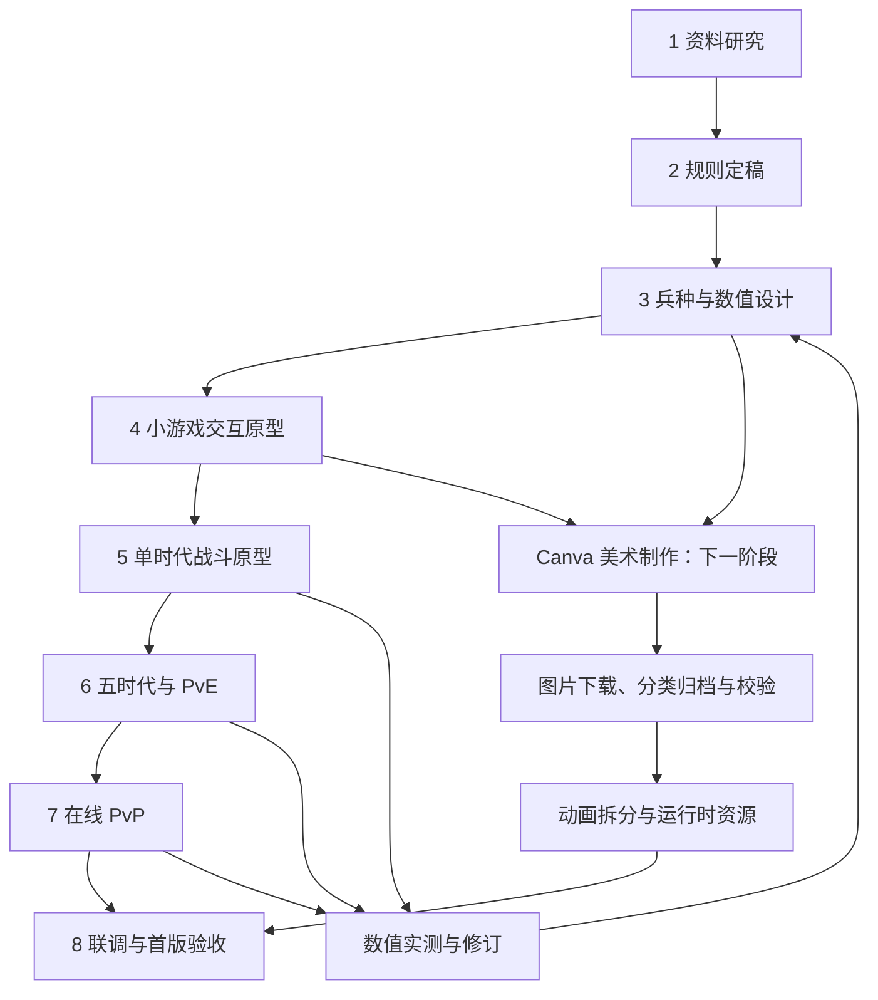

# 《战争进化史》微信小游戏——设计与交付流程

> 发行位置：**微信小游戏**。设计文档已完成，当前进入经典 PvE 代码原型阶段；Canva 素材部分归档，剩余图片待限流解除后继续。实现范围见 [项目说明](../README.md)。  
> 更新日期：2026-09-28。玩法依据：[gameplay.md](gameplay.md)；角色及图片规范：[art.md](art.md)。

## 1. 目标、范围与文档职责

目标是在微信小游戏中完成一款横屏、单线自动战斗的时代进化游戏，首版同时支持：

- PvE：经典 AI 对战三档难度，以及五章、每章三关的战役。
- PvP：真人在线实时 1v1，包含匹配与好友房、权威裁决、重连和结算。
- 五个时代：原始时代、古典文明时代、火药时代、现代战争时代、未来科技时代。
- 每时代六种兵，全部随时代开放，共 30 种单位；当前时代六兵不要求配队取舍、局外解锁或额外研究。
- 单张对称战场、塔位防御、时代技能、出兵队列、人口与金币／EXP 经济。

`gameplay.md` 是规则与兵种 ID 的来源；`art.md` 负责造型、动画要求及 Canva 图片归档；本文负责工作顺序、依赖、交付与验收。修改规则后必须同步受影响的美术、界面和验收条目。

本轮不编写游戏代码、不生成图片；下一阶段使用 Canva 制作图片。后续代码实现按本流程推进。排位、商业化、无尽、多人混战、空战及局外战力成长不属于首版范围。

## 2. 总体设计流程与依赖

文字顺序：资料研究 → 规则定稿 → 兵种与数值 → 交互原型 → 单时代战斗原型 → 五时代与 PvE → 在线 PvP → 联调验收。Canva 制作依赖角色设定和版式规范，可在编码前开始；战斗原型可以使用清晰标记的临时图形，不等待全部最终美术完成。

PvP 的服务端权威边界从规则和原型阶段就确定，联机功能在第 7 阶段接入，避免把已经完成的纯客户端胜负逻辑作为可信比赛结果。

## 3. 八阶段工作清单

### 阶段 1：资料研究

| 项目 | 要求 |
|---|---|
| 输入 | 原有玩法与美术说明、原作者网页版介绍、官方二代移动版介绍 |
| 工作 | 核实时代、出兵、防御、进化等核心结构；区分一代网页版、二代移动版与项目原创扩展 |
| 产出 | 参考来源表、版本与查阅日期、保留机制／新增机制列表 |
| 完成标准 | 每条原作事实有对应链接；不把二代内容归于一代，不把 PvP 描述成原作现成功能 |

已核实来源收录于 [玩法文档第 1 节](gameplay.md#1-参考依据与本项目定位)。调研资料只决定借鉴方向，不冒充精确数值来源。

### 阶段 2：公共规则与模式定稿

| 项目 | 要求 |
|---|---|
| 输入 | 调研结论、已确认双模式与五时代六兵规模 |
| 工作 | 定义资源、人口、队列、进化、护甲、支援、塔、技能、胜负；确定 PvE 暂停与 PvP 权威裁决的区别 |
| 产出 | 公共规则表、模式差异表、两条完整玩家流程、异常裁决表 |
| 完成标准 | 可以逐步推演一场对局；同时摧毁、超时、投降、断线、重复结算均有唯一结果 |

锁定的 PvP 规则为 15 分钟上限、到时比较未四舍五入的基地 HP 比例、同时摧毁平局、60 秒重连窗口、服务端无法可靠恢复的故障局无效。好友房与匹配共用公平规则。

### 阶段 3：兵种、数值与配置设计

| 项目 | 要求 |
|---|---|
| 输入 | 公共规则、原有 15 个角色、五时代定位 |
| 工作 | 保留已有兵，新增每时代三兵；填写属性、费用与技能参数；验证反制、攻城和支援价值；定义配置职责 |
| 产出 | 30 兵种属性表、伤害／护甲表、经济与进化表、塔与技能表、单位 ID 到美术资源键映射 |
| 完成标准 | 五时代各六条有效单位记录；每兵有明确弱点；引用和标签完整；不会依赖名字猜行为 |

数值表至少包含玩法文档第 13 节的单位字段。HP、伤害、射程、支援半径与倍率等未定项在本阶段补齐，标注版本、调整理由与验证记录，随后才能进入可玩原型验收。

试算按以下顺序进行：

1. 同时代同费用比较基础前排、远程与重型，再验证反重甲、兵群和攻城单位。
2. 比较纯战斗兵与加入支援的混编，检查人口占用和治疗叠加是否形成无解阵容。
3. 以相同金币预算测试进攻与建塔，检查纯塔防是否导致对局拖死。
4. 验证跨一时代混编、旧兵队列与进化时机；保留克制作用，进化仍有可感知收益。
5. 记录平均时长、进化时间、各兵出场率、组合胜率与经济轨迹。8～12 分钟仅为 PvP 体验目标，不作为未实测的承诺。

配置只先明确时代、单位、塔／技能、模式、关卡、战斗状态、指令与结算的字段职责。本轮不选择引擎、后端供应商或网络协议，也不编写接口实现。

### 阶段 4：微信小游戏交互原型

| 项目 | 要求 |
|---|---|
| 输入 | 模式流程、30 兵目录、状态与异常规则 |
| 工作 | 绘制首页、模式页、选关页、房间、战斗和结算；验证六兵分页、队列、技能落点与防御面板 |
| 产出 | 可点击页面原型、页面状态清单、触控说明、真机适配检查记录 |
| 完成标准 | 不读开发说明也能开始和结束两种模式；短按出兵／长按详情不冲突，关键信息没有遮挡 |

首页、战斗、弹层和结算均为横屏 Canvas 场景；预留小游戏胶囊和设备安全区域。兵种按 A／B 两组三张显示，防御、技能和进化固定可见。优先验证进化后翻页、金币不足、人口满、等待服务器确认与重连中的表现。

小游戏原型还需验证分享卡片入房、房间码备用入口、前后台切换、方向切换与返回导航。PvE 前后台暂停恢复；PvP 继续进行，回到前台先同步再开放操作。小游戏前后台生命周期和分享 API可核对 [微信官方小游戏 API 类型定义](https://github.com/wechat-miniprogram/minigame-api-typings)（查阅日期 2026-09-28）；基础库和机型兼容性记录在实际原型结果中。

### 阶段 5：单时代六兵战斗原型

| 项目 | 要求 |
|---|---|
| 输入 | 填写完整的原始时代数值、交互原型、占位或已校验美术 |
| 工作 | 跑通自动移动、索敌、伤害、死亡、支援、经济、队列、人口、塔与技能；加入遵守相同资源规则的 AI |
| 产出 | 原始时代六兵可玩 Demo、模拟日志、关键边界场景结果 |
| 完成标准 | 双方能合法出兵并完成胜负；六种兵均有用途；零兵零钱时可靠基础收入恢复出兵 |

从此阶段起将战斗规则、输入指令和表现分开：AI 与玩家产生相同类型的合法意图，模拟负责结果，画面负责表现。后续 PvP 用服务端承担权威模拟，渲染帧率不参与伤害判定。

至少验证资源不足、五项队列已满、三十人口含预留、取消退款、支援目标死亡与双方同一步基地归零。这里的数字沿用玩法初值，数值版本更新时同步场景。

### 阶段 6：五时代内容与 PvE

| 项目 | 要求 |
|---|---|
| 输入 | 单时代原型、其余四时代配置、15 个关卡规格 |
| 工作 | 加入进化与旧兵保留，完成三档 AI、战役敌军策略、暂停快照、关卡进度与结算 |
| 产出 | 完整经典对战、五章战役、关卡配置表、AI 权重表、通关和恢复记录 |
| 完成标准 | 每关可胜可败，公开加成与实际一致；完整五时代可达；重复结算不重复改进度 |

战役按 [玩法文档第 9 节](gameplay.md#9-pve经典对战与战役)逐关实现，不额外引入玩家未选择的无尽或 Boss 系统。关卡选择页和实际战斗读取同一份时代范围、目标、时限与加成，减少文案和逻辑偏差。

首版 PvE 保存本设备进度，不承诺跨设备同步；验证正常暂停、小游戏进入后台、系统回收后的快照恢复及旧版本快照不能恢复时的重试说明。

### 阶段 7：在线 PvP

| 项目 | 要求 |
|---|---|
| 输入 | 共用战斗模拟、模式规则、页面原型、已有单位内容 |
| 工作 | 接入玩家会话、真人匹配、好友房、准备倒计时、权威指令、状态同步、断线重连与唯一结算 |
| 产出 | 两客户端对战链路、房间状态图、重连恢复记录、结束原因与对局日志 |
| 完成标准 | 两台真机可完成匹配／好友房对战；同一对局双方结果一致；非法或重复指令不改变经济 |

客户端只提交操作意图。服务端校验时代、资源、人口、队列、技能目标及指令 ID，固定配置版本，并维护时钟与胜负。客户端不能上报“我击杀了谁”或“我获胜”作为最终依据。

检查搜索取消与配对竞争、准备超时、房主离开、分享旧房间、两人都掉线、断线期间基地被毁、60 秒边界、结算后恢复和服务端故障。首版无真人时明确等待，不以 AI 对手冒充真人。

### 阶段 8：联调、体验与首版验收

| 项目 | 要求 |
|---|---|
| 输入 | 完整 PvE、在线 PvP、已校验图片及动画、数值实测记录 |
| 工作 | 联合检查规则、UI、美术和配置；在微信小游戏真机上验证操作、弱网、性能和资源加载 |
| 产出 | 验收记录、缺陷清单、数值版本、素材清单、发布候选版本说明 |
| 完成标准 | 双模式和 30 兵均可用；关键异常可恢复或明确结束；没有已知重复扣费／错误判胜缺陷 |

运行时目标初值：最低目标设备上双方接近人口上限、含范围技能与塔火力时保持 30 FPS 的可用体验。必须记录真机型号、微信版本、基础库、对局场景和测量结果；达不到时先调整粒子、动画和资源加载，不能通过丢弃战斗判定维持帧率。

最少覆盖 iOS 与 Android、常规屏与带安全区机型、正常网络与断连恢复。实际设备和兼容范围在原型阶段形成清单，不用模拟器结果替代真机记录。发布候选版本应同时具备 PvE 和 PvP，内部单人 Demo 不作为完整首版交付。

## 4. 下一阶段：Canva 兵种图片制作与归档

已确认本轮先完成文档，**下一阶段再使用 Canva 生成图片**。当前尚未创建图片、Canva 设计或图片目录，以下为执行要求。

| 步骤 | 输入与工作 | 交付与完成标准 |
|---|---|---|
| 1. 准备清单 | 从玩法矩阵提取 30 个单位 ID、名称、时代及美术要求 | 五时代各六项，原有角色名称全部保留 |
| 2. 确立样板 | 先生成石棒战士，再制作原始时代六兵；统一粗轮廓、三头身、侧视朝右与阵营色区域 | 六张独立概念图可在小尺寸辨认，不依赖文字标签 |
| 3. 分时代制作 | 使用样板参考，依次完成古典文明、火药、现代战争、未来科技 | 每时代六张独立概念图，造型与职责匹配 |
| 4. 整理导出 | 从概念图制作透明立绘和 1:1 头像，检查背景、肢体、武器、尺寸和裁切 | 每兵一张概念图、一张透明立绘、一张头像；全部下载到本地 |
| 5. 分类归档 | 按时代与单位 ID 保存，记录 Canva 来源、提示词、日期、版本和文件路径 | 30 个单位文件夹、90 个 PNG、完整素材清单与来源记录 |
| 6. 接入准备 | 缩小检查、阵营色对照、动画拆层与运行时图集规划 | 已通过检查的静态素材可交接；动画单独跟踪完成度 |

归档根目录为 `assets/units/`，单位目录例如 `assets/units/age1/age1_melee/`。图片文件分别使用 `unit_age1_melee_concept_v01.png`、`unit_age1_melee_portrait_v01.png`、`icon_unit_age1_melee_v01.png`。完整目录、规格、版本和清单字段见 [美术规范](art.md)。

Canva 在线链接只用于追溯来源，不能代替本地图片交付；拿到预览或链接但尚未保存时标记“待下载”。不能通过修改扩展名伪装 PNG，透明背景必须检查实际 alpha，棋盘格背景图不合格。只有下载并校验完成的文件才进入已交付数量。

生成中断时按清单从未完成单位继续，保留已完成图片；修订另存版本，不静默覆盖。后续工具只能返回在线素材、无法取得下载文件时，完成不受影响的制作和清单工作，并明确列出仍待归档的单位。

## 5. 验收清单与记录方式

### 5.1 本轮文档验收

- 五时代名称、30 个单位 ID 与名称在玩法和美术中一致；原有角色外观说明保留，新增角色有剪影、装备与动画要求。
- 两种模式都具备入口、开局、战斗、结束、重试流程；战役表含目标、时代范围、AI 策略、胜负条件和公开加成。
- 数值初值与固定规则区分；原作事实有版本和来源，本项目扩展明确标注。
- 所有本地文档链接可定位，Markdown 表格列数和代码块闭合；Mermaid 节点、依赖和数值回流关系可读。
- 平台统一为微信小游戏；Canva 制作与本地图片归档按实际状态登记，不能将未生成的图片标记完成。

### 5.2 后续功能验证

| 类别 | 代表场景 | 通过标准 |
|---|---|---|
| 经济与生产 | 不足金币、满队列、满人口、取消正在生产项、连点 | 拒绝不扣费；退款、人口与队列一致，无负资源 |
| 进化 | 旧单位、旧队列、旧塔和技能冷却同时存在 | 仅切换新目录；旧实体与订单保持原配置 |
| 兵种交战 | 穿甲对重甲、爆破对兵群、攻城对建筑、跨时代组合 | 伤害类型与护甲按配置生效，动画不改变逻辑 |
| 支援 | 目标死亡、机械治疗限制、同名光环、多名治疗兵 | 不复活、不越界治疗、不无限叠加、不修基地 |
| 胜负 | 同时摧毁、到时等血比例、投降同一步发生 | 严格按统一优先顺序产生一个结果 |
| 战役 | 15 关的胜、负、重玩、重复结算 | 目标与展示一致，仅胜利解锁下一关 |
| 联机 | 取消匹配、房间满、旧分享卡、重连与双断线 | 唯一有效房间／对局状态，可解释的错误反馈 |
| 权威与去重 | 非法出兵、重复指令、重复结果查询、服务器故障 | 资源和结果以服务端为准，故障局无效且不记胜负 |
| 小游戏适配 | 分享入房、切后台、系统回收、横屏、安全区 | PvE 暂停与恢复合理，PvP 不本地暂停，触控区域不遮挡 |
| 素材 | 30 个单位的 PNG、透明度、尺寸、版本、名称和链接 | 本地文件齐全可打开，来源可查，与玩法配置逐项对应 |

每个验证项记录：配置版本／素材版本、复现步骤、预期结果、实际结果、证据、是否通过及未解决问题。文档检查通过不代表程序测试或图片验收已完成；后续按阶段实际补齐记录。
